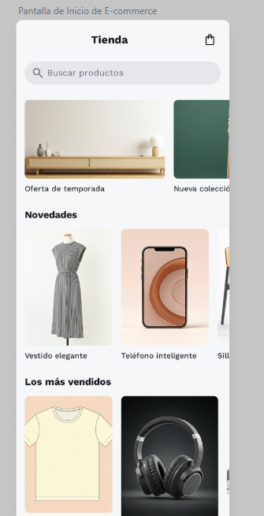

# Proyecto Tienda

Este proyecto tiene como objetivo crear una **página web de tienda básica** utilizando **HTML, CSS y JavaScript**, tomando como referencia un diseño visual alojado en Stitch de Google.

---

##  Diseño del Proyecto

 [Ver diseño en Stitch](https://stitch.withgoogle.com/projects/17531138555422829000)



Utiliza este enlace como guía visual para replicar el diseño del proyecto.

---

##  Estructura del Proyecto

La estructura de carpetas será la siguiente:

```

/proyecto-tienda
│
├── index.html          # Archivo principal con la estructura HTML
├── styles.css          # Archivo de estilos CSS
├── data.js             # Archivo con los datos de los productos
└── /imagenes           # Carpeta que contiene las imágenes de los productos

```

---

## Recursos

* [MDN Web Docs - HTML](https://developer.mozilla.org/es/docs/Web/HTML)
* [MDN Web Docs - CSS](https://developer.mozilla.org/es/docs/Web/CSS)
* [MDN Web Docs - JavaScript](https://developer.mozilla.org/es/docs/Web/JavaScript)

---